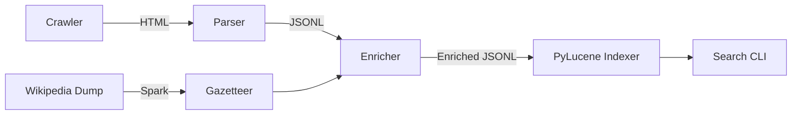

# 🍳 Food Recipes IR Pipeline

**Author:** Maroš Bednár  
**Project:** Advanced Recipe Search Engine with Wikipedia Knowledge Graph  
**Course:** VINF (Information Retrieval)

---

## 📖 Overview

This project is a complete **End-to-End Information Retrieval System** for culinary recipes. It goes beyond simple text search by understanding culinary context through **Entity Linking** with Wikipedia.

The pipeline crawls recipes from Food.com, parses them into structured data, enriches them with knowledge from Wikipedia (processed via **Apache Spark**), and indexes them using **PyLucene** (BM25) for high-performance search with semantic filtering.

### 🚀 Key Features

*   **🕷️ Smart Crawler:** Politeness-aware crawler for Food.com (robots.txt compliant).
*   **🧠 Knowledge Graph:** Extracts culinary entities (ingredients, techniques, tools) from **Wikipedia** using **Apache Spark**.
*   **🔗 Entity Linking:** Uses **Aho-Corasick** algorithm to link recipes to Wikipedia entities in linear time.
*   **🔍 Advanced Search:** **PyLucene** index with **BM25** ranking, supporting complex filters (cuisine, time, ingredients).
*   **⚡ High Performance:** Inverted index structure allows millisecond-level query responses.

---

## 🏗️ Architecture

The system follows a modular pipeline architecture:



1.  **Crawler:** Downloads raw HTML.
2.  **Parser:** Extracts metadata (JSON-LD/Regex).
3.  **Spark Job:** Filters Wikipedia for culinary concepts.
4.  **Enricher:** Links recipes to Wikipedia concepts.
5.  **Indexer:** Builds an inverted index.
6.  **Search:** Provides a CLI for querying.

---

## ⚡ Quick Start

### Prerequisites
*   Python 3.8+
*   Java 11+ (for PyLucene)
*   PyLucene (properly installed and bound)

### Installation
```bash
# Install Python dependencies
pip install -r packaging/requirements.txt
```

### Running the Pipeline
The entire pipeline is controlled via `packaging/run.sh`.

```bash
# 1. Parse downloaded recipes
./packaging/run.sh parse

# 2. Process Wikipedia dump (requires Spark)
./packaging/run.sh wiki_parse

# 3. Enrich recipes with Wikipedia entities
./packaging/run.sh enrich

# 4. Build PyLucene Index
./packaging/run.sh index_lucene

# 5. Search!
./packaging/run.sh search_lucene "mexican chicken" 5
```

---

## 🎮 Usage Examples

### Basic Search
Search for "pasta" and get top 10 results:
```bash
./packaging/run.sh search_lucene "pasta" 10
```

### Advanced Filtering
Search for **Italian** cuisine, ready in **under 30 minutes**, containing **chicken**:
```bash
./packaging/run.sh search_lucene "chicken" 10 --filter '{"cuisine": "Italian", "max_total_minutes": 30}'
```

### Evaluation
Run TREC-style evaluation (Precision@k, MAP) against the test set:
```bash
./packaging/run.sh eval
```

---

## 📂 Project Structure

```
.
├── crawler/            # Web crawler (Food.com)
├── parser/             # HTML/JSON-LD parser
├── spark_jobs/         # PySpark jobs for Wikipedia processing
├── entities/           # Aho-Corasick entity linker
├── indexer/            # PyLucene indexer
├── search_cli/         # Search interface & highlighting
├── data/               # Data storage (Raw, Normalized, Index)
├── docs/               # Documentation & Defense materials
└── packaging/          # Helper scripts (run.sh)
```

---

## 🎓 Defense Materials

For the project defense, refer to:
*   **[docs/DEFENSE_PREPARATION.md](docs/DEFENSE_PREPARATION.md)** - Q&A, stats, and technical deep-dive.
*   **[docs/DEFENSE_WALKTHROUGH.md](docs/DEFENSE_WALKTHROUGH.md)** - Step-by-step presentation script.
*   **[docs/wiki_3pages.md](docs/wiki_3pages.md)** - Detailed academic report.

---

**License:** MIT  
**Status:** Final (Defense Ready)
